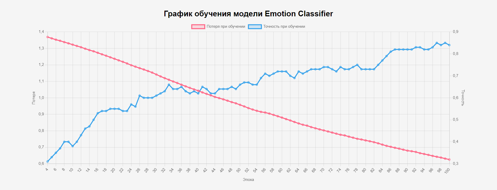

# EmotionRecognizer

Простое веб-приложение для рисования на холсте и классификации рисунков как счастливых или грустных с использованием нейронной сети.

## Введение

Этот проект позволяет пользователям взаимодействовать с нейронной сетью, обучать её для определения эмоции нарисованных изображений.
Представляя из себя веб-приложение, которое позволяет пользователям рисовать на холсте и классифицировать свои рисунки по разным эмоциям, как счастливые, грустные, злые или удивлённые. 
Приложение использует нейронную сеть, созданную с помощью библиотеки TensorFlow.js, для обучения и предсказания эмоции нарисованного изображения.

## Используемый технологический стек

- HTML5
- CSS3
- JavaScript 
- TensorFlowJS
- ChartJS

## Использование

1. **Клонирование репозитория**
   ```sh
   git clone https://github.com/yourusername/EmotionRecognizer.git
   cd EmotionRecognizer

2. **Откройте `index.html` в вашем любимом веб-браузере.**
   

## Структура проекта

- `index.html`: основной файл HTML, содержащий структуру приложения.
- `css/styles.css`: файл стилей CSS для оформления пользовательского интерфейса.
- `scripts/NeuralNetwork.js`: файл с реализацией нейронной сети.
- `scripts/EmotionDrawing.js`: файл с логикой для работы с холстом и взаимодействия с пользователем.

## Функциональность

### Рисование на холсте
- Для рисования на холсте используйте мышь. Поле рисования представляет собой сетку 10x10.
- Для начала рисования удерживайте левую кнопку мыши и перемещайте курсор по холсту.

### Отметка рисунков
- Нажмите кнопку `😀` для отметки рисунка как счастливого лица.
- Нажмите кнопку `🙁` для отметки рисунка как грустного лица.
- Нажмите кнопку `😡` для отметки рисунка как злого лица.
- Нажмите кнопку `😲` для отметки рисунка как удивленного лица.
- Нажмите кнопку `Очистить холст` для очистки текущего рисунка.

### Обучение модели
- Нажмите кнопку `Обучить` для начала процесса обучения нейронной сети на основе сохраненных рисунков. Так же, после первого обучения, модель можно переобучить для достижения более лучших результатов!

### Предсказание эмоции
- После завершения обучения нажмите кнопку `Предсказать`, чтобы классифицировать текущий рисунок как счастливый, грустный, злой или удивлённые.

### Отрисовка графиков после обучения
- После каждой эпохи обучения отрисовываются графики, показывающие изменение потерь и точности модели.
  
  
  
  Пример графика модели на обучении 100 рисунков.

### Пример использования

1. Откройте приложение в вашем веб-браузере.
2. Нарисуйте что-нибудь на холсте, отметьте его, как одну из эмоций.
3. Обучите модель на базе ваших отметок.
4. После обучения, используйте функцию предсказания для новых рисунков.


## Демонстрация

Так же можете посмотреть работающий пример проекта развёрнутый на GitHub Pages: [EmotionRecognizer](https://yankarpov.github.io/EmotionRecognizer/)


   
   


